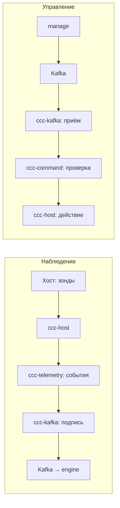

# Архитектура

## Что это

`cybercity-collector` — внешний наблюдатель за гостями цифрового двойника
CyberCity. Работает на хосте (гипервизор или K8s-нода), смотрит на гостей
снаружи, только читает. Подписывает наблюдения (Ed25519) и отправляет в
`cybercity-engine` через Kafka. Команды получает от `cybercity-manage`.

Ключевое свойство: коллектор живёт на привилегию выше цели и недосягаем из
range-сегмента. Наблюдение tamper-proof по конструкции, не по усилию.

Текущий код — in-guest MVP (tail логов, stub-transport, placeholder-подпись).
Целевое состояние — out-of-band зонды, настоящая криптография, реальный
Kafka. Подробнее — в спеках crate'ов, раздел «Что TODO».

## Что делает

1. **Наблюдает** — read-only сбор телеметрии снаружи: файлы, сеть, память,
   процессы, сисколлы. Набор зондов зависит от типа цели, pipeline общий.
2. **Подписывает** — каждое наблюдение упаковывается в конверт с Ed25519
   подписью (key_id + nonce + timestamp, защита от replay).
3. **Отправляет** — подписанные события в Kafka, topic `cc.events.<service_id>`.
   Это авторитетный поток для engine.
4. **Принимает команды** — от manage через `cc.commands.<service_id>`.
   Проверяет подпись и политику, исполняет. Несанкционированная — tamper.
5. **Следит за собой** — state machine (Initializing → Active → Degraded →
   Locked), счётчик tamper, self-health.

## Чего не делает

- Не пишет в гости. Read-only по конструкции.
- Не делает reset или изоляцию. Это manage/фабрика.
- Не доверяет in-guest данным для scoring.
- Не синтезирует события. Движок — регистратор, не симулятор.

## Слои

Шесть слоёв, каждый — отдельный crate:

```
ccc-node       точка сборки, 3 tokio-таски, graceful shutdown
ccc-command    приём команд от manage, проверка, исполнение, tamper
ccc-kafka      transport, подпись конверта, приём команд — граница доверия
ccc-telemetry  цикл опроса зондов, нормализация в события
ccc-host       read-only доступ к хосту, зонды, защита от path traversal
ccc-core       конфиг, политика, lifecycle, типы событий
```

Зависимости (DAG):

```
ccc-node ──► ccc-telemetry ──► ccc-host ──► ccc-core
         └─► ccc-command ──┬─► ccc-host ─┘
                          └─► ccc-kafka ─► ccc-core
         └─► ccc-kafka ────► ccc-core
```

## Потоки данных



### Наблюдение (outbound)

```
Хост (гипервизор / K8s-нода)
    │  зонды (read-only, снаружи гостя):
    │   fs: ZFS-snapshot → ro-mount → integrity diff
    │   net: port-mirror / eBPF-XDP → Zeek/Suricata
    │   mem: virsh dump-guest-memory → Volatility
    │   proc: /proc-walk, lsns
    │   syscall: Falco / Tetragon (контейнеры)
    ▼
ccc-host / ccc-telemetry
    │  наблюдение → AgentEvent (цель: канонический event envelope)
    ▼
ccc-kafka: SecureTransport
    │  обёртка в подписанный конверт: Ed25519 (key_id + nonce + timestamp)
    │  защита от replay; engine верифицирует подпись
    ▼
Kafka / Redpanda (mgmt-плоскость, mTLS + ACL)
    │  topic: cc.events.<service_id>
    │  гости до брокера не достукиваются структурно
    ▼
cybercity-engine
    │  авторитетный поток; на нём считается scoring
```

### Управление (inbound)

```
cybercity-manage
    │  подписанная команда: «наблюдать X» / «снапшот» / «обновить политику»
    │  topic: cc.commands.<service_id>
    ▼
ccc-kafka: приём CommandEnvelope
    ▼
ccc-command: CommandExecutor
    │  проверка policy.allowed_command_kinds
    │  верификация подписи команды
    │  при несанкционированной → lifecycle.record_tamper()
    ▼
Действие (read_file / status / ...) — только в рамках политики
    │  reset / изоляция — НЕ через коллектор; через manage/фабрику
```

## Типы целей и зонды

Коллектор наблюдает три типа целей единообразно:

| Тип | Где | Зонды |
|---|---|---|
| vm | гипервизор (Proxmox/ZFS) | fs (ZFS-snapshot), net (port-mirror/eBPF), mem (virsh dump), proc, syscall |
| container | K8s-нода | overlay2-walk, eBPF-XDP, /proc/\<pid\>/mem, Falco/Tetragon |
| lite | K8s-нода/хост | banner/socket-reachability + минимальный fs; heartbeat |

`honeypot` — не отдельный тип. Это флаг от manage: honeypot-цель наблюдается
как любая другая, обычно lite.

## Доверительная граница

Граница проходит через ccc-kafka. Всё ниже (ccc-host, ccc-telemetry,
ccc-core) — в доверенной плоскости, изолированной от range. Подпись в
ccc-kafka — акт утверждения: «это наблюдение пришло от меня». Engine
верифицирует и принимает как авторитет.

- Коллектор живёт в mgmt-плоскости, без маршрута из range.
- Read-only к гостям: никаких write/reset/изоляции напрямую.
- Ключи Ed25519 — per-host, запечатанные (TPM/Secure Enclave) — цель.
- In-guest обогащение — опционально, best-effort, никогда не источник для
  scoring. «Агент замолчал» — сам по себе сигнал.

## Топики

| Топик | Назначение |
|---|---|
| cc.events.\<service_id\> | события коллектора → engine |
| cc.commands.\<service_id\> | команды manage → коллектор |
| cc.alerts | алерты (цель) |
| cc.audit | аудит (цель) |

## Ссылки

- [`cybercity/COMPOSITION.md`](https://github.com/TheCipherKeeper/cybercity/blob/main/COMPOSITION.md) — состав и доверительная граница.
- [`cybercity/CONVENTIONS.md`](https://github.com/TheCipherKeeper/cybercity/blob/main/CONVENTIONS.md) — event envelope, кросс-репо конвенции.
- [`cybercity/adr/`](https://github.com/TheCipherKeeper/cybercity/blob/main/adr/) — архитектурные решения.