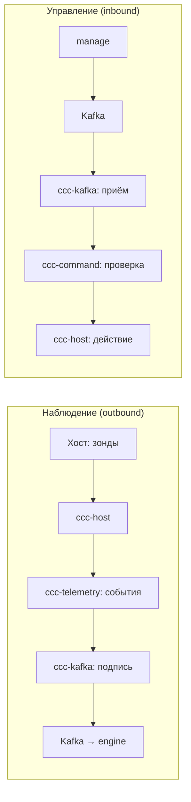

# Архитектура CyberCity Collector

## Что это

`cybercity-collector` — внешний out-of-band per-host наблюдатель за гостями
цифрового двойника CyberCity. Работает на хосте (гипервизор / K8s-нода), читает
гостей снаружи read-only, упаковывает наблюдения в подписанный (Ed25519)
конверт и шлёт в `cybercity-engine` по Kafka. Control-канал — от
`cybercity-manage`.

## Что делает

1. **Наблюдает** — read-only сбор телеметрии снаружи гостя: fs, net, mem, proc,
   syscall. Набор зондов зависит от типа цели (vm/container/lite), pipeline общий.
2. **Упаковывает** — превращает сырые наблюдения в подписанные события
   (Ed25519: key_id + nonce + timestamp, replay-protection).
3. **Отправляет** — кладёт подписанные события в Kafka, topic
   `cc.events.<service_id>`. Это авторитетный поток для engine scoring.
4. **Принимает команды** — от manage через `cc.commands.<service_id>`. Проверяет
   подпись и policy, исполняет. Несанкционированная → record_tamper().
5. **Следит за собой** — lifecycle state machine, tamper counter, self-health.

## Чего не делает

- Не пишет в гости (read-only по конструкции).
- Не делает reset/изоляцию — это manage/фабрика.
- Не доверяет in-guest данным для scoring.
- Не синтезирует события — движок регистратор, не симулятор.

## Слои

6 слоёв, каждый — отдельный crate:

```
┌─────────────────────────────────────────────────────┐
│  ccc-node  — composition root                       │
│  композитит всё, 3 tokio-таски, graceful shutdown    │
├─────────────────────────────────────────────────────┤
│  ccc-command  — control plane (inbound)             │
│  приём команд от manage, проверка policy+подписи,   │
│  исполнение, tamper detection                        │
├─────────────────────────────────────────────────────┤
│  ccc-kafka  — transport + trust boundary             │
│  подпись конверта (Ed25519), Kafka/stdout, приём cmd │
│  ТОЧКА ПЕРЕСЕЧЕНИЯ ДОВЕРИТЕЛЬНОЙ ГРАНИЦЫ             │
├─────────────────────────────────────────────────────┤
│  ccc-telemetry  — collection orchestration          │
│  цикл опроса зондов, чтение manifest, нормализация    │
│  в события, мультиплексирование источников           │
├─────────────────────────────────────────────────────┤
│  ccc-host  — probe layer (out-of-band)              │
│  read-only доступ к хосту, зонды (fs/net/mem/proc),  │
│  path traversal защита, policy enforcement           │
├─────────────────────────────────────────────────────┤
│  ccc-core  — domain core                             │
│  Config, Policy (что разрешено), Lifecycle (health),│
│  Event envelope (контракт с engine)                 │
└─────────────────────────────────────────────────────┘
```

## Два потока данных



### Наблюдение (outbound)

```
Хост (гипервизор / K8s-нода)
    │  out-of-band зонды (read-only, снаружи гостя)
    │   fs: ZFS-snapshot → ro-mount → integrity diff
    │   net: port-mirror / eBPF-XDP на tap → Zeek/Suricata
    │   mem: virsh dump-guest-memory → Volatility
    │   proc: /proc-walk, lsns
    │   syscall: Falco / Tetragon (контейнеры)
    ▼
ccc-host / ccc-telemetry
    │  наблюдение → AgentEvent (цель: канонический event envelope)
    ▼
ccc-kafka: SecureTransport
    │  обёртка в подписанный конверт: Ed25519 (key_id + nonce + timestamp)
    │  replay-protection; engine верифицирует подпись
    ▼
Kafka / Redpanda (mgmt-плоскость, mTLS + ACL на продюсеров)
    │  topic: cc.events.<service_id>
    │  гости до брокера не достукиваются структурно
    ▼
cybercity-engine
    │  авторитетный поток; на нём считается scoring
```

### Управление (inbound)

```
cybercity-manage (контрольная плоскость)
    │  подписанная команда: «наблюдать X» / «снапшот» / «обновить политику»
    │  topic: cc.commands.<service_id>
    ▼
ccc-kafka: приём CommandEnvelope
    ▼
ccc-command: CommandExecutor
    │  проверка policy.allowed_command_kinds
    │  верификация подписи команды
    │  при несанкционированной → lifecycle.record_tamper()
    ▼
Действие (read_file / status / ...) — только в рамках политики
    │  reset / изоляция — НЕ через коллектор; через manage/фабрику
```

## Target kinds & probe matrix

Коллектор target-агностичен: наблюдает все runtime-виды `{vm, container, lite}`
единообразно как out-of-band гости. Набор зондов подбирается под вид, но
probe-pipeline (зонд → конверт → Kafka → engine) общий:

| runtime_kind | Где наблюдается | Зонды |
|---|---|---|
| vm | гипервизор (Proxmox/ZFS) | fs (ZFS-snapshot ro-mount), net (port-mirror/eBPF), mem (virsh dump), proc, syscall |
| container | K8s-нода | overlay2-walk, eBPF-XDP, /proc/\<pid\>/mem, Falco/Tetragon |
| lite | K8s-нода/хост | banner/socket-reachability + минимальный fs; heartbeat от stub'а |

`honeypot` — purpose-атрибут (наживка), передаваемый от manage manifest, не
collector-концепт: honeypot-цель (обычно lite) наблюдается как любая другая.

## Доверительная граница

Доверительная граница проходит через ccc-kafka. Всё ниже (ccc-host,
ccc-telemetry, ccc-core) — в trusted-плоскости, изолированной от range. Подпись
в ccc-kafka — акт утверждения: «это наблюдение пришло от меня, доверенного
коллектора». Engine верифицирует и принимает как авторитет.

## Топики

| Топик | Назначение |
|---|---|
| cc.events.\<service_id\> | события коллектора → engine |
| cc.commands.\<service_id\> | команды manage → коллектор |
| cc.alerts | алерты (цель) |
| cc.audit | аудит (цель) |

## Модель безопасности (кратко)

- Коллектор живёт в mgmt-плоскости, без маршрута из range — недосягаем для цели.
- Read-only по отношению к гостям: никаких write/reset/изоляции напрямую.
- Ключи Ed25519 — per-host, запечатанные (TPM/Secure Enclave где есть) — цель.
- In-guest обогащение — опционально, best-effort, никогда не источник для scoring.

## Связанные документы

- [`cybercity/COMPOSITION.md`](https://github.com/TheCipherKeeper/cybercity/blob/main/COMPOSITION.md) — канон состава и доверительной границы.
- [`cybercity/CONVENTIONS.md`](https://github.com/TheCipherKeeper/cybercity/blob/main/CONVENTIONS.md) — event envelope, кросс-репо конвенции.
- [`cybercity/adr/`](https://github.com/TheCipherKeeper/cybercity/blob/main/adr/) — архитектурные решения (ADR живут в хабе).