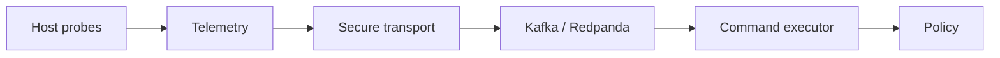

# Архитектура CyberCity Collector

## Назначение и граница

- Ответственность: внешнее read-only наблюдение целей, нормализация событий,
  транспорт и обработка разрешённых команд наблюдения.
- Не изменяет гостей, не выполняет reset/изоляцию и не владеет world-state.
- Самостоятельный сервис нужен для привилегированной out-of-band границы.
- Владелец локального lifecycle и буфера наблюдений: `cybercity-collector`.

## Стек и поставка

- Язык и среда выполнения: Rust 2021, Tokio.
- Проверки: `cargo fmt --check`, `cargo clippy -- -D warnings`, `cargo test`.
- Артефакт: `target/release/cybercity-collector`; внешних портов нет.
- Готовность и быстрая проверка подтверждают, что процесс продолжает выполнять
  telemetry и command loops без fatal error.

## Модули

| Модуль | Ответственность | Спецификация | Язык | Канонический корень | Проверка границ |
|---|---|---|---|---|---|
| `collector` | lifecycle, policy, host probes, telemetry, transport и команды | `docs/specs/collector.md` | rust | `src/collector` | `VER-015` |

Прежние `ccc-core`, `ccc-host`, `ccc-telemetry`, `ccc-kafka`, `ccc-command` и
`ccc-node` находятся в `adapters/outbound` как внутренние компоненты. Это
сохраняет их реализацию и внешние зависимости после удаления публичных crate API.

## Контракты

| Тип | Имя | Версия | Направление | Схема/тесты |
|---|---|---|---|---|
| событие | `cc.events.<service_id>` | `CONVENTIONS@v1` | публикует | тесты telemetry/kafka |
| команда | `cc.commands.<service_id>` | `CONVENTIONS@v1` | потребляет | тесты command |

## Доверительная граница

Collector работает в management-сегменте без маршрута из range. Пути и команды
проверяются policy; ключи и broker credentials поступают вне репозитория.

## Данные и отказоустойчивость

Локальный spool задаётся конфигурацией. Буфер ограничен, lifecycle отражает
деградацию и tamper. Формат конфигурации и событий не меняется.

## Наблюдаемость

Структурированные журналы отражают запуск, lifecycle и ошибки циклов. Deploy
проверяет продолжение работы процесса после стартового окна.
